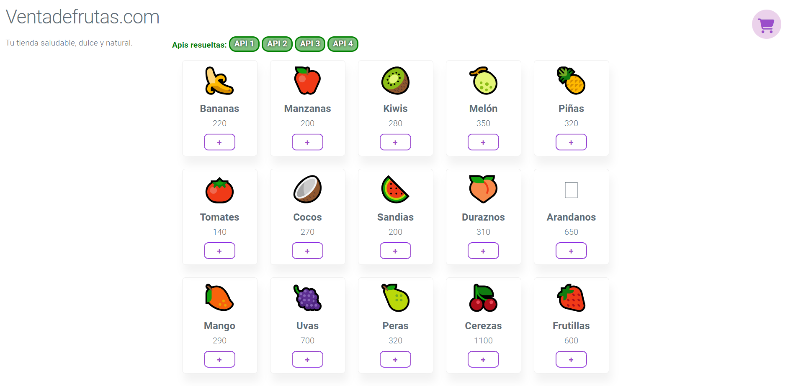
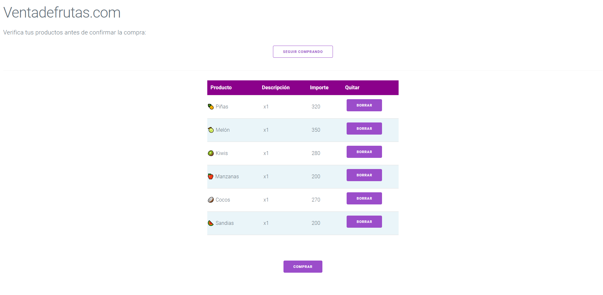

 # PROYECTO DE INTERFAZ DE DESARROLLO
 
 ## Carrito de frutas

 ### El proyecto es una práctica que simula un carrito de compras con frutas, se pueden agregar al carrito y ver los resultados renderizados en el DOM

 
 

  

  

  

## ACTIVIDADES ENTREGADAS:

### ACTIVIDAD 1 ✓ 

### ACTIVIDAD 2 ✓ 

### ACTIVIDAD 3 ✓ 

### ACTIVIDAD 4 ✓ 

 
